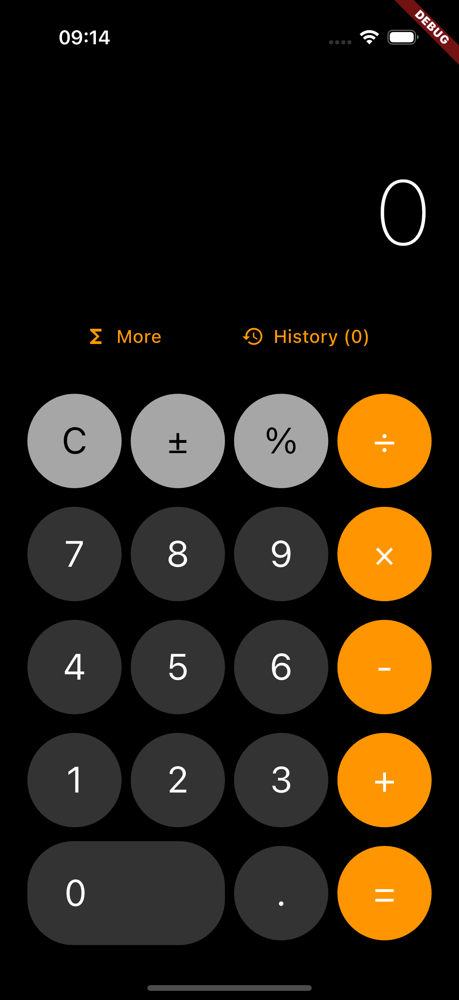
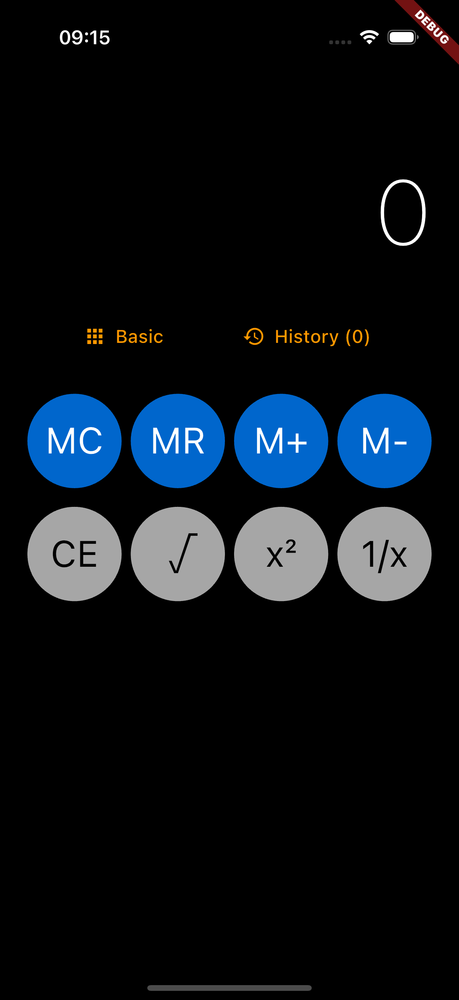
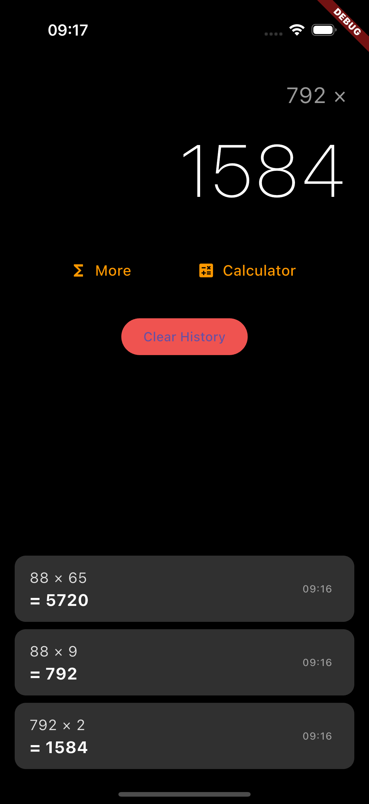

# Interactive Calculator

A modern, feature-rich calculator app built with Flutter that provides a sleek interface with advanced mathematical functions, memory operations, and calculation history.


_Main calculator interface with iPhone-style design_

## Features

### 🧮 Core Calculator Functions

- **Basic Operations**: Addition, subtraction, multiplication, division
- **Decimal Support**: Floating-point calculations with precision handling
- **Sign Toggle**: Change positive/negative values with ± button
- **Percentage Calculations**: Quick percentage operations
- **Clear Functions**: Clear all (C) and clear entry (CE) options

### 📱 Advanced Features

- **Memory Operations**: Store, recall, add to, and subtract from memory (MC, MR, M+, M-)
- **Scientific Functions**: Square root and additional mathematical operations
- **Expandable Interface**: Toggle between basic and advanced function layouts
- **Calculation History**: View and review previous calculations with timestamps
- **Error Handling**: Robust error detection and user-friendly error messages


_Extended calculator with scientific functions_

### 🎨 User Interface

- **Modern Design**: Clean, minimalist interface inspired by iOS calculator
- **Responsive Layout**: Adapts to different screen sizes and orientations
- **Intuitive Controls**: Large, easy-to-tap buttons with visual feedback
- **History Panel**: Slide-out panel to view calculation history
- **Dark/Light Theme**: Automatic theme adaptation


_Calculation history with timestamps_

## Screenshots

|         Main Interface          |            Advanced Functions            |             History View              |
| :-----------------------------: | :--------------------------------------: | :-----------------------------------: |
|  |  |  |

## Technical Architecture

### 📁 Project Structure

```
lib/
├── main.dart              # App entry point and configuration
├── calculator_ui.dart     # User interface components and layouts
├── calculator_logic.dart  # Core calculation engine and business logic
└── data_models.dart       # Data structures and state management models
```

### 🏗️ Key Components

- **CalculatorState**: Immutable state management for calculator operations
- **CalculatorLogic**: Pure functions for mathematical operations and state transitions
- **CalculatorButton**: Configurable button components with different types and styles
- **CalculationHistory**: Historical calculation tracking with timestamps

### 🔧 State Management

The app uses a simple but effective state management pattern with immutable state objects and pure functions for state transitions, ensuring predictable behavior and easy testing.

## Getting Started

### Prerequisites

- Flutter SDK (>=3.7.2)
- Dart SDK
- Android Studio / VS Code with Flutter extensions
- iOS Simulator / Android Emulator or physical device

### Installation

1. **Clone the repository**

   ```bash
   git clone https://github.com/Damilarr/interactive_calculator.git
   cd interactive_calculator
   ```

2. **Install dependencies**

   ```bash
   flutter pub get
   ```

3. **Run the app**
   ```bash
   flutter run
   ```

### Building for Production

#### Android APK

```bash
flutter build apk --release
```

#### iOS (requires macOS and Xcode)

```bash
flutter build ios --release
```

#### Web

```bash
flutter build web
```

## Platform Support

| Platform   | Status       | Notes                      |
| ---------- | ------------ | -------------------------- |
| 📱 iOS     | ✅ Supported | Optimized for iPhone/iPad  |
| 🤖 Android | ✅ Supported | Material Design components |
| 🌐 Web     | ✅ Supported | Progressive Web App ready  |
| 💻 macOS   | ✅ Supported | Native desktop experience  |
| 🪟 Windows | ✅ Supported | Native Windows application |
| 🐧 Linux   | ✅ Supported | GTK-based application      |

## Usage Examples

### Basic Calculations

```
Input: 15 + 25 × 2 =
Result: 65
```

### Memory Operations

```
1. Enter 100, press M+ (stores 100 in memory)
2. Enter 50, press M+ (memory now contains 150)
3. Press MR to recall 150
4. Press MC to clear memory
```

### Scientific Functions

```
√16 = 4
±5 = -5
20% = 0.2
```

## Development

### Code Style

This project follows [Dart style guidelines](https://dart.dev/guides/language/effective-dart/style) and uses `flutter_lints` for consistent code quality.

### Testing

```bash
# Run all tests
flutter test

# Run with coverage
flutter test --coverage
```

## Error Handling

The calculator includes comprehensive error handling for:

- Division by zero
- Invalid mathematical operations
- Number overflow scenarios
- Invalid input sequences
- Memory operation errors


_Error handling and validation examples_

## Dependencies

| Package           | Version | Purpose                  |
| ----------------- | ------- | ------------------------ |
| `flutter`         | SDK     | Core Flutter framework   |
| `cupertino_icons` | ^1.0.8  | iOS-style icons          |
| `flutter_lints`   | ^5.0.0  | Code quality and linting |

**Made with ❤️ using Flutter**
